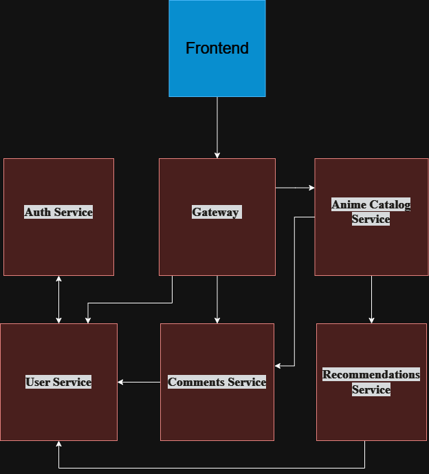

# Anime Haven
## Project Description:
The AnimeHaven Backend is a microservice-based RESTful application built with Java 21 and Spring Boot 3.4, featuring 
OAuth2 for secure authentication. It enables efficient management of anime catalogs, user accounts, and interactive 
features like comments and ratings.

## Stack project
* **Java 21**
* **Spring boot (V3.4.1)**
* **JUnit**
* **Mockito**
* **Jdbc**
* **JPA**
* **Flyaway**
* **Spring Data WebFlux**
* **Eureka**
* **Lombok**

## What's the project about?

This project is about a new anime website using new technologies based on Java Spring stack.
Backend based on 6 microservices: auth service, user service, comments service, recommendations service,
anime catalog service and gateway.

